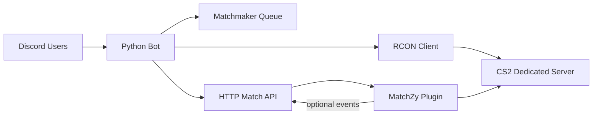

# CS2 Match Bot

Discord bot for organizing **1v1**, **2v2 Wingman**, and **5v5** Counter-Strike 2 matches. The bot queues players on Discord, builds MatchZy match JSON, and loads it on a CS2 dedicated server over RCON.

## Architecture



1. Players link their Steam64 ID in Discord.
2. The bot creates **Queue » 1v1 / 2v2 / 5v5** voice channels, **#queue-status**, and **#match-results**.
3. Players join a queue voice channel and react **✅** on the `#queue-status` message when ready.
4. When enough players are ready, the bot generates MatchZy match JSON and loads it on the server.
5. Players connect to the CS2 server and use MatchZy in-game commands like `.ready`.

## Prerequisites

- Docker and Docker Compose (for running the bot)
- A [Discord bot token](https://discord.com/developers/applications)
- **Either:**
  - A [DatHost CS2 server](https://dathost.net/cs2-server-hosting) with MatchZy installed, **or**
  - A self-hosted CS2 server via Docker (see `docker compose --profile local-server`)

## Quick start

### Option A — DatHost server (recommended for hosted play)

1. Copy and edit `.env`:

```powershell
copy .env.example .env
```

Set at minimum:

```env
CS2_SERVER_PROVIDER=dathost
DATHOST_EMAIL=you@example.com
DATHOST_PASSWORD=your_password
DATHOST_GAME_SERVER_ID=your_server_id_from_dathost_panel
BOT_PUBLIC_URL=https://your-public-https-url
DISCORD_TOKEN=...
DISCORD_GUILD_ID=...
```

2. Install **MatchZy** on your DatHost server and configure webhooks — see [cs2/dathost-setup.md](cs2/dathost-setup.md).

3. Start **bot only**:

```powershell
docker compose up -d --build match-bot
```

4. Run `/admin testserver` in Discord to verify the DatHost connection.

### Option B — Local Docker CS2 server

1. Copy `.env` and set `CS2_SERVER_PROVIDER=local`, `SRCDS_TOKEN`, etc.

2. Start bot + local CS2:

```powershell
docker compose --profile local-server up -d --build
```

Set `CS2_HOST=cs2-server` in `.env` when using Docker Compose.

### Common setup (both options)

1. Edit `.env`:

| Variable | Description |
|---|---|
| `CS2_SERVER_PROVIDER` | `local` (self-hosted) or `dathost` |
| `DISCORD_TOKEN` | Discord bot token |
| `DISCORD_GUILD_ID` | **Required** for auto channel setup and queue UI |
| `DISCORD_ADMIN_ROLE_ID` | Discord role ID for bot admins (can use `/admin` commands without server admin) |
| `DATHOST_EMAIL` | DatHost account email (`CS2_SERVER_PROVIDER=dathost`) |
| `DATHOST_PASSWORD` | DatHost account password |
| `DATHOST_GAME_SERVER_ID` | Server ID from DatHost control panel URL |
| `BOT_PUBLIC_URL` | **Public HTTPS URL** for MatchZy match JSON + webhooks |
| `SRCDS_TOKEN` | Steam game server token (local Docker server only) |
| `CS2_RCON_PASSWORD` | RCON password (local Docker server only) |
| `MATCHZY_API_KEY` | Shared secret for match JSON + webhook endpoints |
| `DEFAULT_MAP` | Default map for voice queues (default `de_dust2`) |
| `QUEUE_READY_TIMEOUT_SECONDS` | Ready-up window for a **full 5v5** queue (default `300`). Scales by mode: 1v1 = 1 min, 2v2 = 2 min, 5v5 = 5 min |
| `ELO_DEFAULT` | Starting ELO for new players (default `1000`) |
| `ELO_K_FACTOR` | ELO K-factor per match (default `32`) |
| `CS2_PUBLIC_HOST` | Public IP or hostname players use in `connect` (optional) |
| `CS2_PW` | Server password shown to players (optional) |
| `MATCHZY_ADMINS` | Comma-separated Steam64 IDs for in-game MatchZy admins |

3. Start the bot (see Option A or B above).

4. Invite the bot to your Discord server with these scopes/permissions:

- Scopes: `bot`, `applications.commands`
- Permissions: `Manage Channels`, `Move Members`, `Connect`, `View Channels`, `Send Messages`, `Embed Links`, `Use Slash Commands`

5. Start the bot, then run `/admin setup` (or let it auto-create channels on startup if `DISCORD_GUILD_ID` is set).

6. In Discord:

```
/profile link steam_id:76561198000000000
Join voice channel: Queue » 1v1 / 2v2 / 5v5
Open #queue-status and react ✅ when ready
```

## Queue flow

| Step | Action |
|---|---|
| 1 | Link Steam with `/profile link` |
| 2 | Join a **Queue » …** voice channel — you are added to that queue automatically and `#queue-status` updates live |
| 3 | Open **#queue-status** and review the live queue embed |
| 4 | React **✅** on the `#queue-status` message when ready, or **❌** / remove ✅ to unready |
| 5 | Once the queue is **full**, everyone must ready within a mode-sized window (1v1: 1 min, 2v2: 2 min, 5v5: 5 min at default settings) or the queue is cancelled |
| 6 | For **2v2 / 5v5**, lobby players vote for **Team Alpha** and **Team Bravo** captains via **Vote Captains** |
| 7 | Elected captains alternate **Pick Player** until both teams are full, then the match starts |

The `#queue-status` message is posted and kept up to date automatically when players join or leave queue voice channels. It shows every queued player with ✅ ready / ⏳ not ready status, **✅** and **❌** reactions for ready/unready, live captain vote/draft progress for 2v2/5v5, and **Vote Captains** / **Pick Player** buttons. Leave a queue voice channel to leave the queue. When a queue reaches full size, all players must ready before the mode-scaled timeout (`QUEUE_READY_TIMEOUT_SECONDS`, default 5 minutes for 5v5) or the queue is cancelled and players are moved out of the voice channel.

When a match starts, the bot creates temporary team voice channels (e.g. `Match abc12345 » Team Alpha`) and moves players into them. When the match ends (MatchZy webhook or `/admin endmatch`), players are moved back to the voice channel they were in before the match, and the team channels are deleted.

## Supported maps

Voice queues always use `DEFAULT_MAP` from `.env` (default **Dust II** / `de_dust2`). Join a **Queue » …** voice channel to enter the queue for that mode. Supported map ids include all current CS2 maps (see `bot/maps.py`).

| Pool | Maps |
|---|---|
| **Active Duty** | Ancient, Anubis, Dust II, Inferno, Mirage, Nuke, Overpass |
| **Reserve** | Train, Vertigo, Basalt, Edin, Thera, Mills, Stronghold, Warden, Alpine |
| **Hostage** | Office, Italy |
| **Wingman** | Sanctum, Poseidon |
| **Arms Race** | Baggage, Shoots, Pool Day |
| **Legacy** | Cache, Cobblestone, Tuscan |

Map ids use the server format (e.g. `de_mirage`, `cs_office`, `ar_baggage`). The full list lives in `bot/maps.py`.

## ELO system

Each player has a separate ELO rating for **1v1**, **2v2**, and **5v5**. Ratings start at `1000` by default and update automatically when MatchZy sends a `series_end` or `match_end` webhook with a winner.

- View your ratings with `/profile show`
- View top players with `/profile leaderboard mode:5v5`
- Completed match results are posted in **#match-results** (scroll to view history)
- ELO changes are included in each result post

ELO uses standard team-average expected score with a configurable K-factor (`ELO_K_FACTOR` in `.env`). Admin-cancelled matches (`/admin endmatch`) do not change ELO.

## Discord commands

| Command | Description |
|---|---|
| `/help` | Show commands and how to queue/play |
| `/profile link` | Link your 17-digit Steam64 ID |
| `/profile show` | Show linked Steam account and ELO ratings |
| `/profile leaderboard` | Top 10 players by mode |
| `/queue status` | Show queue sizes |
| `/admin setup` | Create/recreate voice + status channels (admin role or Manage Channels) |
| `/admin resetcaptains` | Clear captain votes/draft and restart selection (admin role required) |
| `/admin setcaptain` | Assign a captain and restart vote/draft (admin role required) |
| `/admin testserver` | Test connection to local RCON or DatHost server |
| `/admin forcestart` | Force-start the MatchZy match (admin role required) |
| `/admin endmatch` | End the active MatchZy match (admin role required) |

Set `DISCORD_ADMIN_ROLE_ID` in `.env` to grant `/admin` commands to a custom role. Server administrators always have access. If the role ID is not set, only server administrators can run those commands.

**Captain selection (2v2 / 5v5):** When enough players are ready, a lobby opens for captain **voting** in `#queue-status`. Each lobby player votes for Team Alpha and Team Bravo captains using **Vote Captains**. After voting, captains alternate **Pick Player** until rosters are full. Only admins can override with `/admin setcaptain` or `/admin resetcaptains`; either command clears the current vote/draft and restarts the process. Removing your ready reaction, leaving the queue, or a lobby player leaving also resets the active lobby.

## MatchZy integration

The bot communicates with MatchZy using:

- **Local server:** TCP RCON (`CS2_HOST`, `CS2_PORT`, `CS2_RCON_PASSWORD`)
- **DatHost server:** [DatHost Console API](https://dathost.net/docs) (MatchZy commands sent to server console)
- **HTTP JSON** at `GET /matches/{match_id}.json` for match configuration
- **Webhooks** at `POST /matchzy/events` for match results and ELO

After the CS2 container creates its data directory, configure MatchZy inside `cs2-data/game/csgo/cfg/MatchZy/config.cfg`:

```cfg
matchzy_remote_log_url "http://match-bot:8080/matchzy/events"
matchzy_remote_log_header_key "X-API-Key"
matchzy_remote_log_header_value "your-matchzy-api-key-from-env"
matchzy_kick_when_no_match_loaded 0
```

Restart the CS2 server after editing MatchZy config.

For **DatHost**, see [cs2/dathost-setup.md](cs2/dathost-setup.md) for FTP paths and public URL requirements.

## Local development (bot only)

```powershell
cd bot
python -m venv .venv
.\.venv\Scripts\Activate.ps1
pip install -r requirements.txt
copy ..\.env.example ..\.env
python main.py
```

Run the CS2 server separately with Docker Compose, or point `CS2_HOST`/`CS2_PORT` at an existing server.

## Ports

| Service | Port |
|---|---|
| CS2 game | `27015/tcp+udp` |
| CS2 TV | `27020/udp` |
| Bot HTTP API | `8080/tcp` |

## Troubleshooting

- **RCON authentication failed**: Check `CS2_RCON_PASSWORD` (local) or run `/admin testserver` (DatHost).
- **DatHost commands not working**: Ensure MatchZy is installed and `DATHOST_*` credentials are correct.
- **Match JSON load fails on DatHost**: `BOT_PUBLIC_URL` must be a public **HTTPS** URL reachable from the internet.
- **Match JSON 401**: Ensure `MATCHZY_API_KEY` matches the header sent by `matchzy_loadmatch_url`.
- **Players kicked as NOT ALLOWED**: They must join with the exact Steam64 ID linked in Discord.
- **Slash commands missing**: Set `DISCORD_GUILD_ID` for instant guild sync, or wait up to an hour for global sync.
- **Voice queue not detected after restart**: Run `/admin setup` once, or restart the bot with `DISCORD_GUILD_ID` set so channels reload on startup.
- **Ready reaction does nothing**: Join a queue voice channel first and link Steam with `/profile link`.

## Project layout

```
cs2-match-bot/
├── docker-compose.yml
├── .env.example
├── bot/
│   ├── main.py
│   ├── bot_app.py
│   ├── guild_setup.py
│   ├── queue_ui.py
│   ├── elo.py
│   ├── elo_service.py
│   ├── match_results.py
│   ├── dathost_client.py
│   ├── server_console.py
│   ├── server_connect.py
│   ├── matchmaker.py
│   ├── matchzy.py
│   ├── rcon.py
│   ├── http_server.py
│   └── storage.py
└── cs2/
    └── README.md
```

## License

MIT
