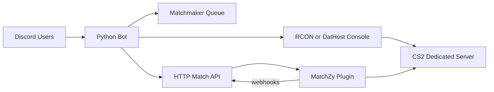

# CS2 Match Bot

Discord bot for organizing **1v1**, **2v2 Wingman**, and **5v5** Counter-Strike 2 matches. The bot queues players on Discord, runs captain draft and Premier-style map veto, builds MatchZy match JSON, and loads it on a CS2 dedicated server.

**No typed commands** — everything is buttons, reactions, and select menus.

## Architecture



1. Players link their Steam64 ID in Discord.
2. The bot creates matchmaking channels under **CS2 Matchmaking** (voice queues, `#queue-status`, `#bot-commands`, `#match-results`, `#elo-leaderboard`, **End Queue**).
3. Players join a queue voice channel and react **✅** on `#queue-status` when ready.
4. When enough players are ready, the bot runs captain selection (2v2/5v5), Premier map veto, and side pick (CT/T).
5. The bot generates MatchZy match JSON and loads it on the server.
6. The bot waits for the game port to accept connections, then posts connect info (HTTPS join link + console command).
7. Players connect to the CS2 server and type `.ready` in game chat (MatchZy warmup).
8. MatchZy sends webhooks when the map/series ends — the bot posts results, updates ELO, and cleans up voice channels.

**DatHost requirement:** the game server must reach your bot at **`BOT_PUBLIC_URL` over HTTPS (port 443)** to download match JSON. Without that, maps will not change and roster kicks may occur.

## Prerequisites

- Docker and Docker Compose (for running the bot)
- A [Discord bot token](https://discord.com/developers/applications)
- **Either:**
  - A [DatHost CS2 server](https://dathost.net/cs2-server-hosting) with MatchZy installed, **or**
  - A self-hosted CS2 server via Docker (see `docker compose --profile local-server`)
- For DatHost: a **public HTTPS URL** for the bot (`BOT_PUBLIC_URL`) — reverse proxy required (nginx, Caddy, Cloudflare Tunnel, etc.)

## Quick start

### Option A — DatHost server (recommended for hosted play)

1. Copy and edit `.env`:

```bash
cp .env.example .env
```

Set at minimum:

```env
CS2_SERVER_PROVIDER=dathost
DATHOST_EMAIL=you@example.com
DATHOST_PASSWORD=your_password
DATHOST_GAME_SERVER_ID=your_server_id_from_dathost_panel
BOT_PUBLIC_URL=https://your-public-https-url
DISCORD_TOKEN=...
DISCORD_GUILD_ID=...
MATCHZY_API_KEY=long-random-secret
```

2. Install **MatchZy** on your DatHost server and configure webhooks — see [cs2/dathost-setup.md](cs2/dathost-setup.md).

3. Start **bot only**:

```bash
docker compose up -d --build match-bot
```

4. In Discord, react **🔌** on the admin panel in `#bot-commands` to verify the DatHost connection.

Set `MATCH_STATUS_POLL_SECONDS=0` for DatHost (RCON polling is local-only).

### Option B — Local Docker CS2 server

1. Copy `.env` and set `CS2_SERVER_PROVIDER=local`, `SRCDS_TOKEN`, etc.

2. Start bot + local CS2:

```bash
docker compose --profile local-server up -d --build
```

Set `CS2_HOST=cs2-server` in `.env` when using Docker Compose.

### Common setup (both options)

#### Environment variables

| Variable | Description |
|---|---|
| `CS2_SERVER_PROVIDER` | `local` (self-hosted) or `dathost` |
| `DISCORD_TOKEN` | Discord bot token |
| `DISCORD_GUILD_ID` | **Required** for auto channel setup and queue UI |
| `DISCORD_ADMIN_ROLE_ID` | Discord role ID for bot admins (admin panel without server admin) |
| `DATHOST_EMAIL` | DatHost account email (`CS2_SERVER_PROVIDER=dathost`) |
| `DATHOST_PASSWORD` | DatHost account password |
| `DATHOST_GAME_SERVER_ID` | Server ID from DatHost control panel URL |
| `BOT_PUBLIC_URL` | **Public HTTPS URL** for MatchZy match JSON + webhooks |
| `SRCDS_TOKEN` | Steam game server token (local Docker server only) |
| `CS2_RCON_PASSWORD` | RCON password (local Docker server only) |
| `MATCHZY_API_KEY` | Shared secret for match JSON + webhook endpoints |
| `DEFAULT_MAP` | Default map for voice queues (default `de_dust2`) |
| `QUEUE_READY_TIMEOUT_SECONDS` | Ready-up window once a queue is **full** (default `300`) |
| `MAP_RESULT_FINISH_FALLBACK_SECONDS` | Auto-finish after `map_result` if `series_end` webhook is missing (default `20`, `0` disables) |
| `MATCH_STATUS_POLL_SECONDS` | Poll `get5_status` via RCON for match end — **local CS2 only** (default `45`, `0` disables) |
| `QUEUE_STATUS_REFRESH_SECONDS` | Live refresh of `#queue-status` during lobby/match phases (default `15`, `0` disables) |
| `TRANSIENT_MESSAGE_SECONDS` | Auto-delete most bot notices after N seconds (default `5`) |
| `MATCH_RESULTS_RETAIN_COUNT` | Keep the last N result posts in `#match-results` (default `5`) |
| `ELO_DEFAULT` | Starting ELO for new players (default `1000`) |
| `ELO_K_FACTOR` | ELO K-factor per match (default `32`) |
| `CS2_PUBLIC_HOST` | Public IP or hostname for `connect` (recommended on DatHost if API returns a hostname) |
| `CS2_PUBLIC_PORT` | Game port override (optional; otherwise from DatHost API) |
| `CS2_PW` | Server password shown to players (optional; leave empty for open servers) |
| `CS2_CONNECT_PREFER_IP` | Prefer numeric IP from DatHost API for connect commands (default `true`) |
| `DATHOST_POST_DEPLOY_SETTLE_SECONDS` | Wait after `matchzy_loadmatch_url` before UDP check (default `45`) |
| `DATHOST_UDP_READY_TIMEOUT_SECONDS` | Max seconds to poll until game port responds (default `120`) |
| `DATHOST_UDP_POLL_SECONDS` | Interval between UDP readiness polls (default `5`) |
| `DATHOST_CONNECT_REFRESH_SECONDS` | Min seconds between DatHost connect-info API polls (default `60`) |
| `MATCHZY_ADMINS` | Comma-separated Steam64 IDs for in-game MatchZy admins (local server only) |

#### Discord bot invite

Invite the bot with these scopes/permissions:

- Scopes: `bot`
- Permissions: `Manage Channels`, `Move Members`, `Connect`, `View Channels`, `Send Messages`, `Embed Links`, `Add Reactions`, `Read Message History`, `Manage Messages`

**Message Content Intent is not required** — the bot does not read typed messages.

#### First run

When `DISCORD_GUILD_ID` is set, the bot auto-creates channels on startup. To recreate or refresh panels later, click **Refresh Setup** on the admin panel in `#bot-commands`.

## Discord channels

| Channel | Purpose |
|---|---|
| **Queue » 1v1 / 2v2 / 5v5** | Join to enter the queue for that mode |
| **#queue-status** | Live queue embed, lobby buttons, ✅/❌ ready reactions |
| **#bot-commands** | Pinned player + admin control panels |
| **#match-results** | Live match embed during play; final results after each match |
| **#elo-leaderboard** | Pinned top-10 leaderboard (resets every 3 months) |
| **End Queue** | Players return here when a match ends |

## Player controls

Use the pinned panel in **#bot-commands** (or duplicate buttons on **#queue-status** where noted):

| Control | Where | Action |
|---|---|---|
| **My Profile** | `#bot-commands` | Linked Steam ID and ELO for all modes |
| **Leaderboard** (dropdown) | `#bot-commands` | Top 10 for 1v1 / 2v2 / 5v5 |
| **Link Steam Account** | `#bot-commands` or `#queue-status` | Opens a modal for your 17-digit Steam64 ID |
| **Unlink Steam** | `#bot-commands` or `#queue-status` | Removes your Steam link |
| **✅ / ❌** | `#queue-status` | Ready / unready |
| **Vote Captains** | `#queue-status` | Vote for Team Alpha and Team Bravo captains (2v2/5v5) |
| **Pick Player** | `#queue-status` | Captain draft pick |
| **Ban Map** | `#queue-status` | Premier veto ban |
| **Pick Side** | `#queue-status` | Choose CT or T after veto |
| **Report: Team Alpha/Bravo Won** | `#match-results` | Majority roster vote if webhooks fail |
| **End Match (No ELO)** | `#match-results` | Majority roster vote — cleanup only, no ELO |

## Admin controls

Pinned admin panel in **#bot-commands**:

| Control | Action |
|---|---|
| **Refresh Setup** (button) | Create or refresh all matchmaking channels and panels |
| 🛑 | End active match (no ELO, cleanup voice) |
| ▶️ | Force-start MatchZy on the server |
| 🔌 | Test DatHost + UDP game port reachability; shows connect address |
| 1️⃣ / 2️⃣ / 5️⃣ | Reset lobby captain draft for 1v1 / 2v2 / 5v5 |

**Refresh Setup** requires bot admin role, server administrator, or **Manage Channels**.

Admin reactions require bot admin role or server administrator.

Set `DISCORD_ADMIN_ROLE_ID` in `.env` to grant the admin role without Discord server admin.

## Queue flow

| Step | Action |
|---|---|
| 1 | Link Steam via **Link Steam Account** |
| 2 | Join a **Queue » …** voice channel — you are added automatically and `#queue-status` updates |
| 3 | React **✅** on `#queue-status` when ready, or **❌** / remove ✅ to unready |
| 4 | Once the queue is **full**, everyone must ready within **5 minutes** (default) or the queue is cancelled |
| 5 | For **2v2 / 5v5**, lobby players vote for captains via **Vote Captains** |
| 6 | Captains alternate **Pick Player** until both teams are full |
| 7 | **Premier map veto** — captains alternate **Ban Map** until one map remains |
| 8 | The non-banning captain **Pick Side** (CT or T); the match deploys to the server |

Leave a queue voice channel to leave the queue.

When a match starts, the bot creates temporary **CT** and **T** voice channels and moves players to their assigned side. The match embed includes a **Launch CS2 and Join** link (opens `/join` on your bot, then Steam) and a `connect host:port` console command.

**Wait for “Server is online”** in Discord before connecting — MatchZy reloads the map when a match deploys and the UDP port is closed for 30–90 seconds.

When the match ends (MatchZy webhook, player report, or admin 🛑), players move to **End Queue**, team channels are deleted, and the result is posted to `#match-results`.

## Supported maps

Voice queues use `DEFAULT_MAP` from `.env` (default **Dust II** / `de_dust2`). **Premier map veto** uses the **Active Duty** pool only (7 maps).

| Map | ID |
|---|---|
| Ancient | `de_ancient` |
| Anubis | `de_anubis` |
| Dust II | `de_dust2` |
| Inferno | `de_inferno` |
| Mirage | `de_mirage` |
| Nuke | `de_nuke` |
| Overpass | `de_overpass` |

The canonical list lives in `bot/maps.py` (`CS2_MAPS`, `PREMIER_VETO_POOL`, `MAP_ALIASES`).

## ELO system

Each player has a separate ELO rating for **1v1**, **2v2**, and **5v5**. Ratings start at `1000` by default and update when MatchZy sends a `series_end` webhook with a winner.

- View ratings via **My Profile** on `#bot-commands`
- View top players via the **Leaderboard** dropdown on `#bot-commands`
- Live top-10 boards in **#elo-leaderboard** (resets every 3 months)
- Completed match results in **#match-results** with per-player ELO deltas
- Admin-cancelled matches (🛑 or **End Match (No ELO)**) do not change ELO

## MatchZy integration

The bot communicates with MatchZy using:

- **Local server:** TCP RCON (`CS2_HOST`, `CS2_PORT`, `CS2_RCON_PASSWORD`)
- **DatHost server:** [DatHost Console API](https://dathost.net/docs) (MatchZy commands sent to server console)
- **HTTP JSON** at `GET /matches/{match_id}.json?key=MATCHZY_API_KEY` (auth via query string — DatHost fetches this URL)
- **Webhooks** at `POST /matchzy/events` with header `X-API-Key: MATCHZY_API_KEY`

On match deploy (DatHost), the bot:

1. Clears any previous MatchZy state (`css_endmatch`, etc.)
2. Enters match mode (`css_match`)
3. Sends `matchzy_loadmatch_url` with the full HTTPS JSON URL (including `?key=`)
4. Waits for the game UDP port to respond, then sets `css_readyrequired`

Match JSON includes the veto-selected map, CT/T side assignment (`map_sides`), roster Steam64 IDs, and `skip_veto: true`. Forfeit-on-disconnect is disabled in match JSON cvars where supported.

**DatHost (public HTTPS):** edit `csgo/cfg/MatchZy/config.cfg` on the game server via FTP:

```cfg
matchzy_remote_log_url "https://your-bot.example.com/matchzy/events"
matchzy_remote_log_header_key "X-API-Key"
matchzy_remote_log_header_value "your-matchzy-api-key-from-env"
matchzy_kick_when_no_match_loaded 0
matchzy_ffw_enabled 0
matchzy_gg_enabled 0
```

**Local Docker Compose:** use the internal hostname in `cs2-data/game/csgo/cfg/MatchZy/config.cfg`:

```cfg
matchzy_remote_log_url "http://match-bot:8080/matchzy/events"
matchzy_remote_log_header_key "X-API-Key"
matchzy_remote_log_header_value "your-matchzy-api-key-from-env"
matchzy_kick_when_no_match_loaded 0
matchzy_ffw_enabled 0
matchzy_gg_enabled 0
```

Restart the CS2 server after editing MatchZy config.

Some DatHost MatchZy builds do not support `matchzy_ffw_enabled` / `matchzy_gg_enabled` as console commands — set them in `config.cfg` only (ignore `Unknown command` in the server console).

For **DatHost**, see [cs2/dathost-setup.md](cs2/dathost-setup.md).

### Match end flow

1. MatchZy sends `map_result` → live embed updates; fallback timer starts.
2. ~2 seconds later, MatchZy sends `series_end` → ELO update, result post, voice cleanup.
3. If `series_end` never arrives, the bot finishes from `map_result` after `MAP_RESULT_FINISH_FALLBACK_SECONDS`.
4. **Workaround:** roster players use **Report** buttons on the `#match-results` live embed (majority must agree).

## Deploy on AWS (or any VPS)

DatHost hosts the game server — run **only the bot** on your VPS behind HTTPS.

### 1. Back up before replacing an old install

```bash
cd ~/cs2-match-bot
cp .env ~/.env.cs2-match-bot.backup
docker cp cs2-match-bot:/app/data/bot.sqlite3 ~/bot.sqlite3.backup   # optional
docker compose down
cd .. && rm -rf cs2-match-bot
```

Use `docker compose down -v` only if you want a fresh database (loses ELO/player links).

### 2. Upload the project

Copy `bot/`, `docker-compose.yml`, and `.env.example` to `~/cs2-match-bot/` on the server. Restore `.env` from backup or create from `.env.example`.

### 3. Build and start

```bash
cd ~/cs2-match-bot
docker compose build --no-cache match-bot
docker compose up -d match-bot
docker compose logs -f match-bot
```

### 4. Reverse proxy (required for DatHost)

The bot listens on **8080** inside Docker. DatHost must reach **`https://your-domain`** on port **443**. Do not expose 8080 publicly — use nginx (or Caddy) on the VPS.

**AWS:** open inbound **80/tcp** and **443/tcp** on the instance security group.

**Install nginx + SSL (Ubuntu example):**

```bash
sudo apt install -y nginx certbot python3-certbot-nginx
sudo nano /etc/nginx/sites-available/cs2-match-bot
```

```nginx
server {
    listen 80;
    server_name your-domain.example.com;

    location / {
        proxy_pass http://127.0.0.1:8080;
        proxy_http_version 1.1;
        proxy_set_header Host $host;
        proxy_set_header X-Real-IP $remote_addr;
        proxy_set_header X-Forwarded-For $proxy_add_x_forwarded_for;
        proxy_set_header X-Forwarded-Proto $scheme;
    }
}
```

```bash
sudo ln -sf /etc/nginx/sites-available/cs2-match-bot /etc/nginx/sites-enabled/
sudo rm -f /etc/nginx/sites-enabled/default
sudo nginx -t && sudo systemctl reload nginx
sudo certbot --nginx -d your-domain.example.com
```

Set `BOT_PUBLIC_URL=https://your-domain.example.com` in `.env` and restart the bot.

**Optional DatHost connect overrides** (if players timeout or hostname fails):

```env
CS2_PUBLIC_HOST=123.45.67.89
CS2_PUBLIC_PORT=27015
CS2_PW=
```

### 5. Verify

```bash
curl -s http://127.0.0.1:8080/health
curl -s https://your-domain.example.com/health
curl -s "https://your-domain.example.com/matches/1.json?key=YOUR_MATCHZY_API_KEY" | head
```

All should succeed. The third command must return match JSON (401 means wrong `MATCHZY_API_KEY`).

DatHost console should show `[LoadMatchFromURL] Received following data:` — not `Connection refused`.

### 6. DatHost + Discord

- Configure MatchZy webhooks on DatHost (see above).
- Click **Refresh Setup** in `#bot-commands` after first deploy.
- React 🔌 on the admin panel to test DatHost connectivity.

Player data persists in the Docker volume `bot-data` (`/app/data/bot.sqlite3`).

## Local development (bot only)

```bash
cd bot
python -m venv .venv
source .venv/bin/activate   # Windows: .\.venv\Scripts\Activate.ps1
pip install -r requirements.txt
cp ../.env.example ../.env
python main.py
```

Run the CS2 server separately with Docker Compose, or point `CS2_HOST`/`CS2_PORT` at an existing server.

## Ports

| Service | Port |
|---|---|
| CS2 game | `27015/tcp+udp` |
| CS2 TV | `27020/udp` |
| Bot HTTP API | `8080/tcp` |

## Troubleshooting

### DatHost / HTTPS / match load

| Symptom | Cause | Fix |
|---|---|---|
| DatHost: `Connection refused (your-domain:443)` | HTTPS not working | Fix nginx + certbot; open AWS port 443 |
| HTTPS **502 Bad Gateway** | Bot container down | `docker compose up -d match-bot`; check `curl http://127.0.0.1:8080/health` |
| Map stays on `de_dust2` / no roster | Match JSON never loaded | Fix HTTPS; check DatHost for `[LoadMatchFromURL]` errors |
| Bot log: no `Serving match JSON for N` | DatHost never fetched JSON | Same as above |
| `Unauthorized match JSON request` | Wrong API key | Match `MATCHZY_API_KEY` in `.env` with URL `?key=` and webhook `config.cfg` |

### Connect / join

| Symptom | Cause | Fix |
|---|---|---|
| Timeout **5003**, `Recv: 0 pkts` | Joined during map reload or port closed | Wait for **Server is online** in Discord (~30–90s after match start) |
| Connect works after reboot, fails on match | Map reload closes UDP briefly | Expected — wait for bot ready signal |
| Works with IP, not hostname | DNS / client issue | Set `CS2_PUBLIC_HOST` to numeric IP from DatHost panel |

### MatchZy / kicks

| Symptom | Cause | Fix |
|---|---|---|
| `KICKING PLAYER ... (NOT ALLOWED!)` | Steam64 not in match roster | Re-link correct **steamID64** from [steamid.io](https://steamid.io); only queued players can join |
| Kicked when no match loaded | `matchzy_kick_when_no_match_loaded 1` | Set to `0` in DatHost `config.cfg`, reboot server |
| `Unknown command 'matchzy_ffw_enabled'` | Older MatchZy build | Set ffw/gg in `config.cfg` only — harmless |

### Bot / Discord

- **RCON authentication failed**: Check `CS2_RCON_PASSWORD` (local) or react 🔌 on the admin panel (DatHost).
- **DatHost commands not working**: Ensure MatchZy is installed and `DATHOST_*` credentials are correct.
- **Voice queue not detected after restart**: Click **Refresh Setup** or restart the bot with `DISCORD_GUILD_ID` set.
- **Ready reaction does nothing**: Join a queue voice channel first and link Steam.
- **Deploy import errors on server**: Sync the entire `bot/` folder before rebuilding — partial uploads cause crashes.
- **Match ends in-game but voice channels stay / no ELO**: Webhooks not reaching the bot. Look for `POST /matchzy/events` and `series_end` in logs. Fix `matchzy_remote_log_url` on the CS2 server. **Workaround:** **Report** buttons on the live embed, or admin 🛑.
- **Live score stuck on “Score pending”**: Same as above — `round_end` webhooks not arriving.
- **Discord 429 rate limits on `#queue-status`**: Increase `QUEUE_STATUS_REFRESH_SECONDS` (e.g. `30`).
- **Logs full of scanner probes**: Normal internet noise — harmless 404s; the bot filters most of this.

**Private server** on DatHost only hides the server from the public browser — it does not block direct `connect`. Kicks with **NOT ALLOWED** are roster/Steam ID issues, not the private-server setting.

## Project layout

```
cs2-match-bot/
├── docker-compose.yml
├── .env.example
├── bot/
│   ├── main.py
│   ├── bot_app.py
│   ├── command_panel.py
│   ├── guild_setup.py
│   ├── queue_ui.py
│   ├── steam_link_ui.py
│   ├── match_finish_ui.py
│   ├── message_lifecycle.py
│   ├── matchzy_events.py
│   ├── match_status_poll.py
│   ├── captain_flow.py
│   ├── premier_veto_flow.py
│   ├── match_sides.py
│   ├── match_voice.py
│   ├── live_match.py
│   ├── elo.py
│   ├── elo_service.py
│   ├── elo_leaderboard.py
│   ├── elo_season.py
│   ├── match_results.py
│   ├── dathost_client.py
│   ├── server_console.py
│   ├── server_connect.py
│   ├── server_query.py
│   ├── matchmaker.py
│   ├── matchzy.py
│   ├── maps.py
│   ├── rcon.py
│   ├── http_server.py
│   └── storage.py
└── cs2/
    ├── README.md
    └── dathost-setup.md
```

## License

MIT
